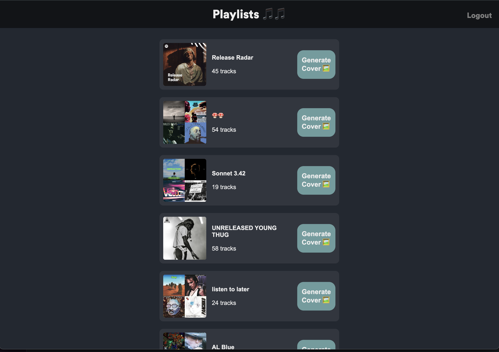
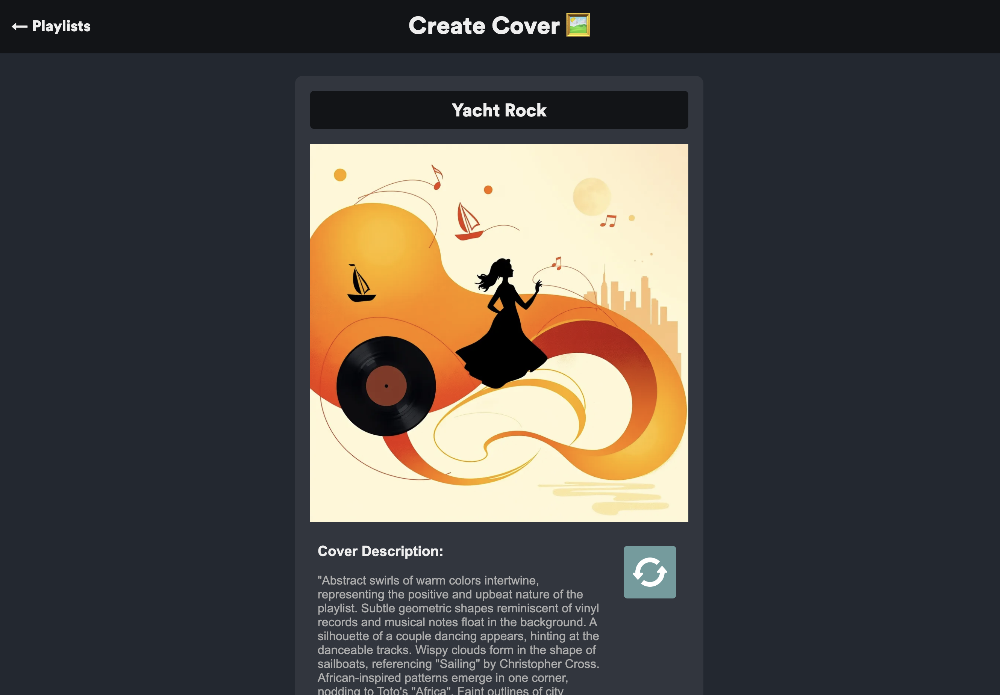

# Description
This project integrates with a user's Spotify account and then creates an image representation of a user's playlist using AI. The
models used are Claude 3.5 Sonnet and Flux.1-schnell.

## Spotify Auth
if auth breaks go to : (http://127.0.0.1:8081/spotify/auth/) and pray

## color pallet

#222831
#31363F
#76ABAE
#EEEEEE
rgb(34, 40, 49)
rgb(49, 54, 63)
rgb(118, 171, 174)
rgb(238, 238, 238)

## Push to Prod
"scp -i ~/FirstKey.pem -r spotify ubuntu@ec2-3-145-147-169.us-east-2.compute.amazonaws.com:~/"

## Ideas
- Add image download button
- Add button that adds generated image to actual playlist
- Fine tune on album artwork - Lora?
- Effeciency
    - Add loading bar
    - Make it so that it loads the template and then loads the prompt and image
- Save a record of all the images that people save
    - Want to do some analysis of why these images were chosen
    - A/B prompt testing